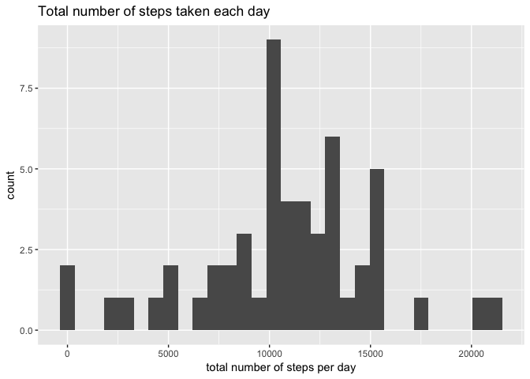
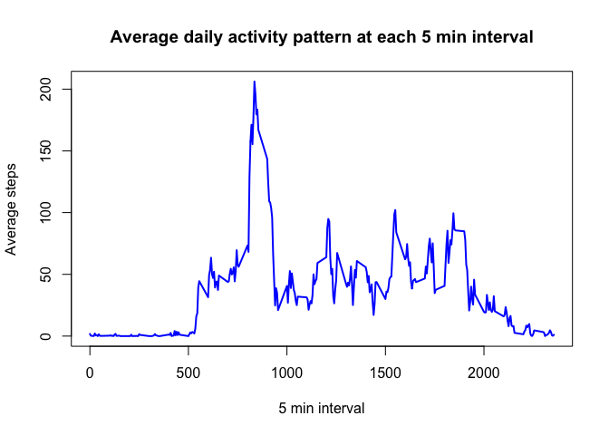

# Reproducible Research: Project 1
This assignment makes use of data from a personal activity monitoring device. This device collects data at 5 minute intervals through out the day. The data consists of two months of data from an anonymous individual collected during the months of October and November, 2012 and include the number of steps taken in 5 minute intervals each day.

The variables included in this dataset are:
steps: Number of steps taking in a 5-minute interval (missing values are coded as 𝙽𝙰)
date: The date on which the measurement was taken in YYYY-MM-DD format
interval: Identifier for the 5-minute interval in which measurement was taken
The dataset is stored in a comma-separated-value (CSV) file and there are a total of 17,568 observations in this dataset.


## Loading and preprocessing the data.

```r
library(data.table)
```

```
## Warning: package 'data.table' was built under R version 3.3.2
```

```r
library(dplyr)
```

```
## Warning: package 'dplyr' was built under R version 3.3.2
```

```
## 
## Attaching package: 'dplyr'
```

```
## The following objects are masked from 'package:data.table':
## 
##     between, first, last
```

```
## The following objects are masked from 'package:stats':
## 
##     filter, lag
```

```
## The following objects are masked from 'package:base':
## 
##     intersect, setdiff, setequal, union
```

```r
library(stats)
library(lattice)
```

```
## Warning: package 'lattice' was built under R version 3.3.2
```

```r
library(ggplot2)
```

```
## Warning: package 'ggplot2' was built under R version 3.3.2
```

```r
library(knitr)
```

```
## Warning: package 'knitr' was built under R version 3.3.2
```

```r
fileUrl <- 
        "https://d396qusza40orc.cloudfront.net/repdata%2Fdata%2Factivity.zip"
download.file(fileUrl, "dataset.zip")
unzip("dataset.zip")
data <- read.csv("./activity.csv", header = TRUE,na.strings = c("NA"),
        colClasses = c("numeric", "Date", "numeric"))
```

## What is mean total number of steps taken per day? Ignore missing values.
### Calculate the total number of steps taken per day.

```r
data2 <- na.omit(data)
byday <- data2 %>% group_by(date) %>% summarize(sum = sum(steps))
```
### Make a histogram of the total number of steps taken each day

```r
ggplot(byday, aes(sum)) + geom_histogram() + 
        labs(title="Total number of steps taken each day", 
                x="total number of steps per day")
```

```
## `stat_bin()` using `bins = 30`. Pick better value with `binwidth`.
```

<!-- -->
### Calculate and report the mean and median of the total number of steps taken per day

```r
mean(byday$sum)
```

```
## [1] 10766.19
```

```r
median(byday$sum)
```

```
## [1] 10765
```

#What is the average daily activity pattern?
##Make a time series plot (i.e. 𝚝𝚢𝚙𝚎 = "𝚕") of the 5-minute interval (x-axis) and the average number of steps taken, averaged across all days (y-axis)

```r
avgsteps <- data2 %>% group_by(interval) %>% summarize(avgsteps = mean(steps))
plot(avgsteps$interval,avgsteps$avgsteps, type="l", col="blue",lwd=2,
     main="Average daily activity pattern at each 5 min interval",
     xlab="5 min interval",
     ylab="Average steps")
```

<!-- -->
### Which 5-minute interval, on average across all the days in the dataset, contains the maximum number of steps?

```r
x <- which(avgsteps$avgsteps==max(avgsteps$avgsteps))
avgsteps[x,]
```

```
## # A tibble: 1 x 2
##   interval avgsteps
##      <dbl>    <dbl>
## 1      835 206.1698
```

## Imputing missing values
Note that there are a number of days/intervals where there are missing values (coded as 𝙽𝙰). The presence of missing days may introduce bias into some calculations or summaries of the data.
1. Calculate and report the total number of missing values in the dataset (i.e. the total number of rows with 𝙽𝙰s)

```r
length(data[is.na(data)])
```

```
## [1] 2304
```
2. Devise a strategy for filling in all of the missing values in the dataset. The strategy does not need to be sophisticated. For example, you could use the mean/median for that day, or the mean for that 5-minute interval, etc.

The strategy is to use the mean of the entire data set for single imputation of missing values of steps.

3. Create a new dataset that is equal to the original dataset but with the missing data filled in.

```r
data3 <- data
temp <- data3$steps
temp[is.na(temp)] <- mean(temp[!is.na(temp)])
data3$steps <- temp
```
4. Make a histogram of the total number of steps taken each day and Calculate and report the mean and median total number of steps taken per day. Do these values differ from the estimates from the first part of the assignment? What is the impact of imputing missing data on the estimates of the total daily number of steps?

```r
byday2 <- data3 %>% group_by(date) %>% summarize(sum = sum(steps))
ggplot(byday2, aes(sum)) + geom_histogram() + 
        labs(title="Total number of steps taken each day with mean imputation",
                x="total number of steps per day")
```

```
## `stat_bin()` using `bins = 30`. Pick better value with `binwidth`.
```

<!-- -->

```r
mean(byday2$sum)
```

```
## [1] 10766.19
```

```r
median(byday2$sum)
```

```
## [1] 10766.19
```
Since we used the mean for the imputation strategy, the mean did not change, but the median increased from 10765 to 10766.19.


## Are there differences in activity patterns between weekdays and weekends?

For this part the 𝚠𝚎𝚎𝚔𝚍𝚊𝚢𝚜() function may be of some help here. Use the dataset with the filled-in missing values for this part.

1. Create a new factor variable in the dataset with two levels – “weekday” and “weekend” indicating whether a given date is a weekday or weekend day.

```r
weekend <- c('Saturday', 'Sunday')
data3$day <- factor((weekdays(data3$date) %in% weekend), 
                   levels=c(TRUE, FALSE), labels=c('weekend', 'weekday'))
```
2. Make a panel plot containing a time series plot (i.e. 𝚝𝚢𝚙𝚎 = "𝚕") of the 5-minute interval (x-axis) and the average number of steps taken, averaged across all weekday days or weekend days (y-axis). See the README file in the GitHub repository to see an example of what this plot should look like using simulated data.

```r
avgsteps2 <- data3 %>% group_by(day,interval) %>% summarize(avgsteps = mean(steps))
xyplot(avgsteps~interval | day,data=avgsteps2,layout=c(1,2), type="l",
       main="Average daily activity pattern at each 5 min interval",
       xlab="5 min interval",
       ylab="Average steps"
       )
```

<!-- -->

